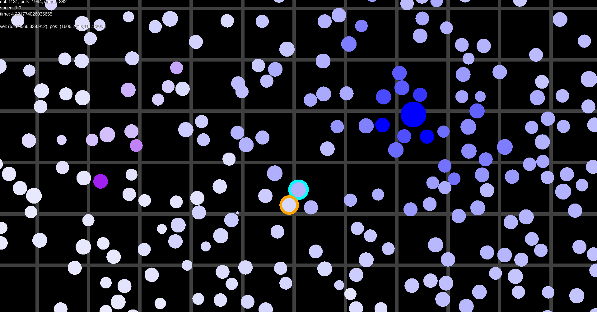

## Collider
Physically accurate collider of absolutely elastic spheres, 2D.
As accurate as the floating point number precision allows.

Screenshot:

### Idea
This collider predicts time of each collision, waits for the time and calculates them.
In process of waiting collisions can be cancelled.
This provides physically accurate simulation of absolutely elastic bodies.
This collider does not support rolling or resting bodies, but it could be.

### Realization
Collider has set of "synchronized" objects, for each of their collisions collider already knows everything.
When we add new object to this set, we check all objects, that can collide ours, and choose one of them, which collides first.
This collider has optimization, where field is split into many chunks, it significantly reduces amount of objects to check.
When objects collide, collider changes their speed, removes these objects from 'synchronized' set, and adds them back.

### Priority Queue
Each collision waits for time to be happened in priority queue, where time of collision is priority,
it needs to be fast in methods "add(obj)", "removeFirst()" and "remove(obj)" in the same time,
java default priority queue says, that it is slow in "remove(obj)", so I made own queue:
I used TreeSet with two comparators: by priority, and then by id of object.

### Controls:
* WASD - move camera
* ESC - exit
* F11 - toggle fullscreen
* Q/E - decrease/increase simulation speed
* SPACE - pause simulation
* R - reverse simulation direction (just reverse speed of each object)
* left mb on sphere - choose sphere to observe
* right mb - give sphere ability to dye other spheres
* mouse wheel - change scale

### Info:
Top left corner
* avg - average amount of collisions per frame for 60 frames, sum - total amount of collisions
* speed - relative game speed
* time - current simulation time
* vel/pos - velocity/position of sphere at time of last collision, this is shown only if you are observing a sphere.

You can download executable jar by [this link](https://github.com/Matvey24/Collider/raw/master/desktop/build/libs/desktop-1.0.jar).

Some time ago project had button "Turn RTX ON", so project has ray tracing engine, which uses opencl.
I do not understand java version of opencl library good, so now there are no button,
because now it somehow could not work on my gpu, but it could work on my integrated graphics.
Engine does not have bounding box hierarchy support, so with current amount of spheres it would not work fast even on gpu.
